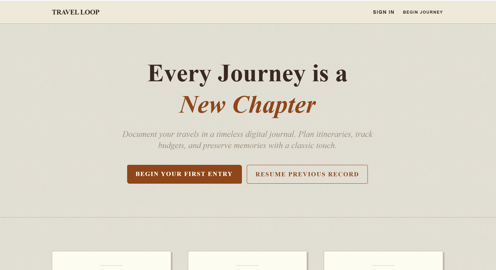
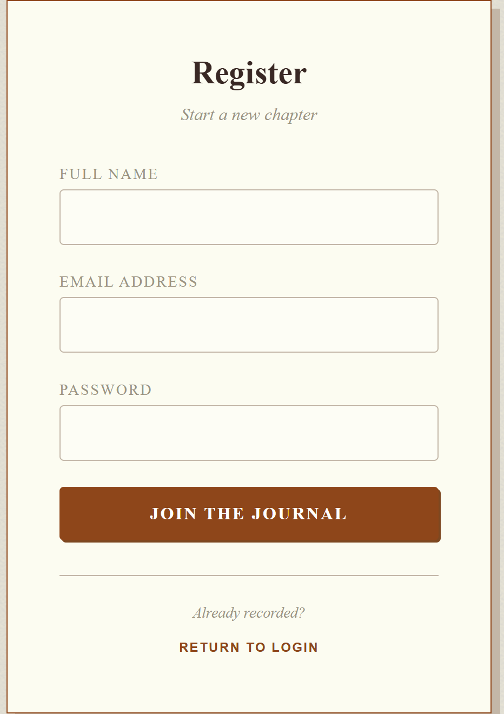
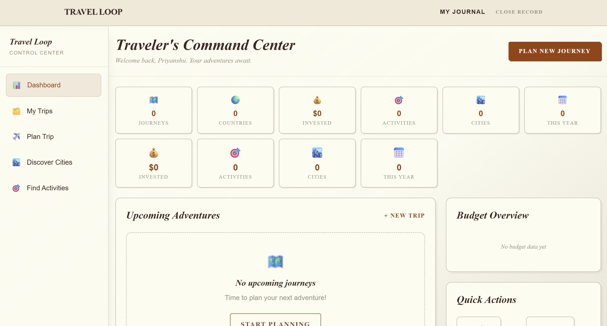
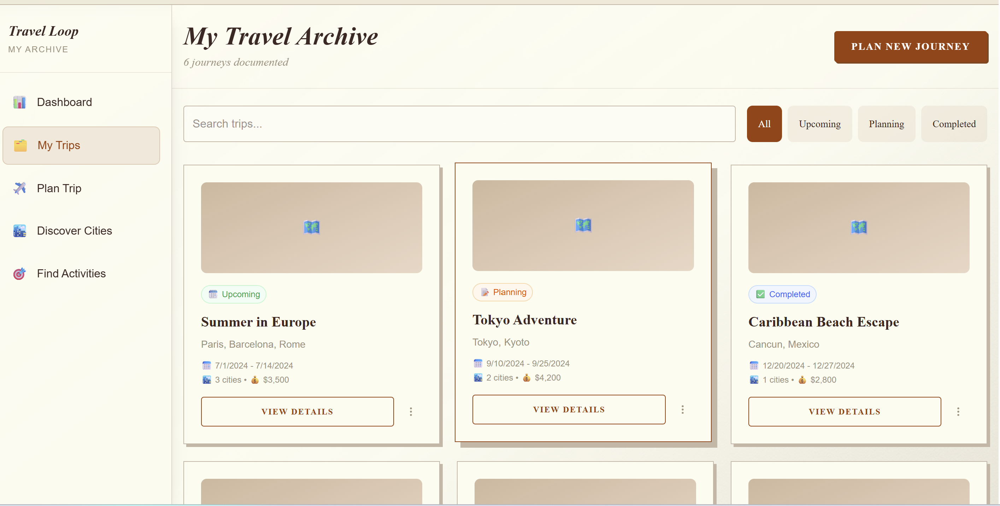
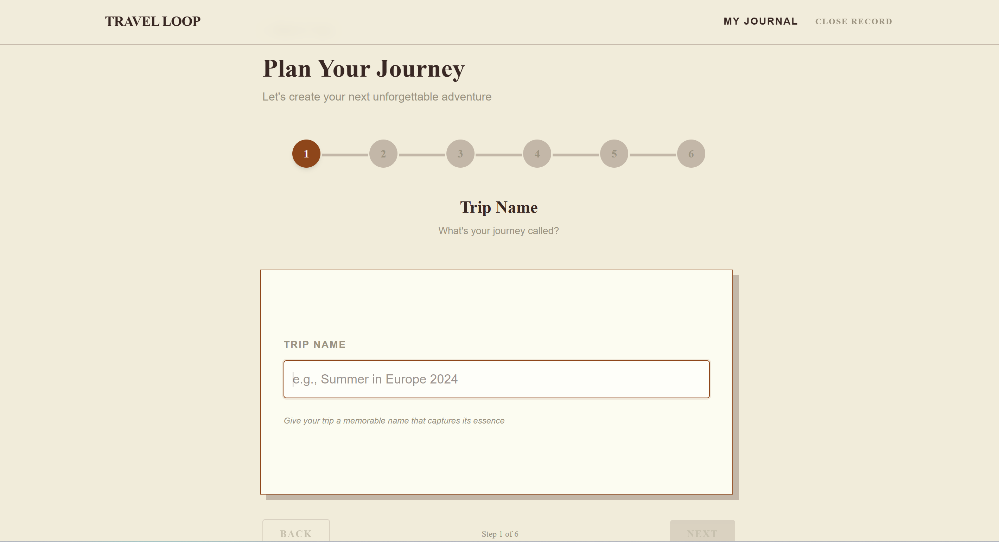

README TITLE
# 🌍 Travel Loop – Travel Itinerary Planning Platform

Travel Loop is a full-stack travel itinerary planning platform that helps users organize trips, manage budgets, maintain packing checklists, and document travel experiences in a single application.

The platform provides an intuitive workflow for planning journeys, tracking travel expenses, managing destinations, and maintaining personal travel journals.

Built using Next.js, React, PostgreSQL, Prisma ORM, and Auth.js.
LIVE DEMO
## 🚀 Live Demo

🔗 https://travel-loop-beta.vercel.app/

## ✨ Features

- 🔐 Secure user authentication and session management
- 🗺️ Create and manage travel itineraries
- 💰 Budget planning and expense tracking
- 📦 Packing checklist management
- 📖 Travel journal and trip documentation
- 📊 Dashboard with trip statistics and analytics
- 🔍 Search and filter trips
- 📱 Responsive design across devices

## 🛠️ Tech Stack

### Frontend
- Next.js
- React.js
- Tailwind CSS

### Backend
- Next.js API Routes
- Prisma ORM

### Database
- PostgreSQL

### Authentication
- Auth.js (NextAuth)

### Deployment
- Vercel
SCREENSHOTS

Ye section bahut important hai.

## 📸 Screenshots

### Landing Page

### Authentication

### Dashboard

### My Trips

### Trip Planning Workflow

PROJECT STRUCTURE
## 🧠 Core Modules

### Authentication
User registration, login, and session management.

### Trip Management
Create, update, and organize travel plans.

### Budget Tracking
Track expenses and monitor travel budgets.

### Packing Lists
Maintain travel checklists.

### Travel Journal
Store travel notes and memories.

### Dashboard
Visual overview of journeys and travel activity.
WHY I BUILT THIS

Interviewer ye section dekh ke impress hota hai.

## 💡 Motivation

Many travelers use multiple tools for itinerary planning, budget tracking, packing lists, and note-taking.

The goal of Travel Loop was to bring these workflows into a single platform and provide a more organized travel planning experience.
LEARNING
## 📚 What I Learned

- Building full-stack applications using Next.js
- Database modeling with PostgreSQL and Prisma
- Authentication and session management
- API integration and frontend-backend communication
- Responsive UI development
- Deploying production applications using Vercel
